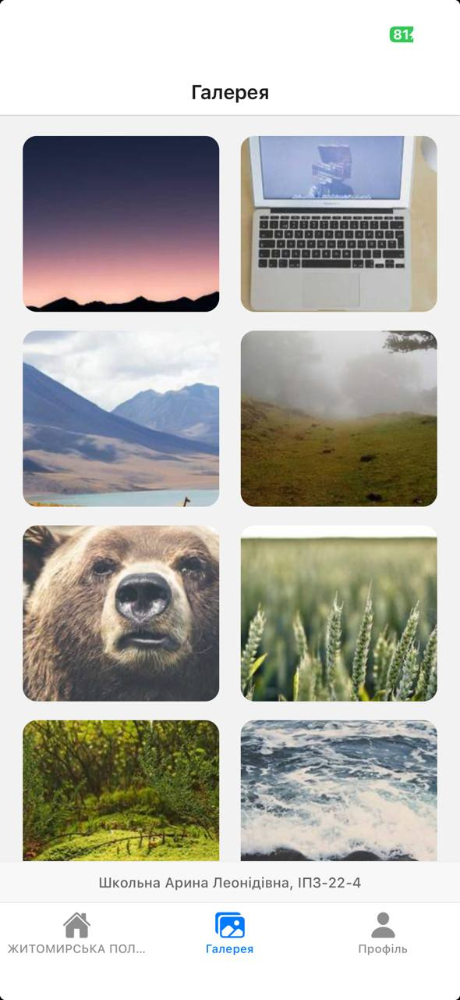
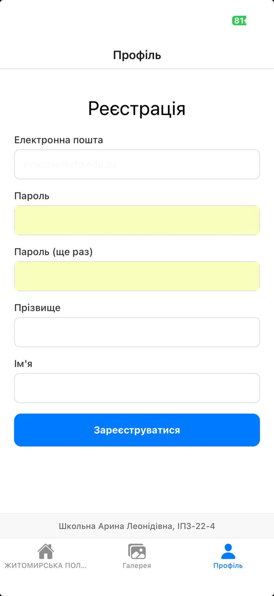

# Лабораторна робота №1: Знайомство з React Native та Expo

**Виконала:** Школьна Арина Леонідівна  
**Група:** ІПЗ-22-4

## 1. Опис проєкту
Цей проєкт є першою лабораторною роботою з курсу розробки мобільних додатків. Основна мета — навчитися створювати та налаштовувати проєкт у середовищі Expo, працювати з базовими компонентами React Native (View, Text, ScrollView, TextInput, TouchableOpacity, Image) та налаштовувати навігацію за допомогою `@react-navigation/native`.

**Функціонал додатка:**
* **Головна (Новини)**: відображення списку новин через `ScrollView`.
* **Фотогалерея**: сітка із зображеннями, завантаженими з мережі.
* **Профіль**: форма реєстрації з валідацією та інтерактивною кнопкою.

## 2. Інструкція із запуску
Для запуску проєкту на локальному комп'ютері виконайте наступні кроки:

1. **Клонуйте репозиторій:**
   ```bash
   git clone [https://github.com/ТвійЛогін/MobileLabsRN2026.git](https://github.com/cxsarina/MobileLabsRN2026.git)
   cd MobileLabsRN2026/lab1
   ```
2. **Встановіть залежності:**
   ```bash
   npm install
   ```
3. **Запуск проекту:**
   ```bash
   npx expo start
   ```
4. **Відкрийте додаток:**
   Скануйте QR-код за допомогою додатка Expo Go (на iPhone через камеру).

## 3. Опис способів запуску мобільного додатка
Згідно з інструкцією, існують різні способи тестування та запуску додатка:

1. **Фізичний пристрій (через Expo Go)**
   - Призначення: Перевірка реальної продуктивності, тактильних відчуттів від інтерфейсу та роботи з «залізом» (камера, сенсори).

   - Особливості: Найшвидший спосіб тестування для розробників.

   - Відмінності: Дозволяє побачити додаток так, як його бачитиме кінцевий користувач.
2. **Емулятор (Android Studio) або Симулятор (iOS/Xcode)**
   - Призначення: Тестування на різних версіях ОС та розмірах екранів без наявності реальних гаджетів.

   - Особливості: Потребує багато ресурсів комп'ютера.

   - Відмінності: Не завжди точно передає продуктивність графіки та мережеві затримки.
3. **Режим Tunnel (ngrok)**
   - Призначення: Запуск додатка, коли комп'ютер і телефон знаходяться в різних мережах або коли локальна мережа (LAN) блокується фаєрволом.

   - Особливості: Дані проходять через зовнішній сервер, що може бути повільнішим за LAN.

   - Відмінності: Необхідний для роботи в університетських або корпоративних мережах із обмеженнями.
4. **Web-браузер**
   - Призначення: Швидка перевірка розмітки та логіки без мобільного пристрою.

   - Особливості: Не всі нативні модулі (наприклад, Bluetooth або певні типи жестів) працюють у браузері.

   - Відмінності: Найпростіший спосіб для відладки стилів (через Inspect Element).

## 4. Скріншоти
### Головна сторінка


### Галерея


### Реєстрація
