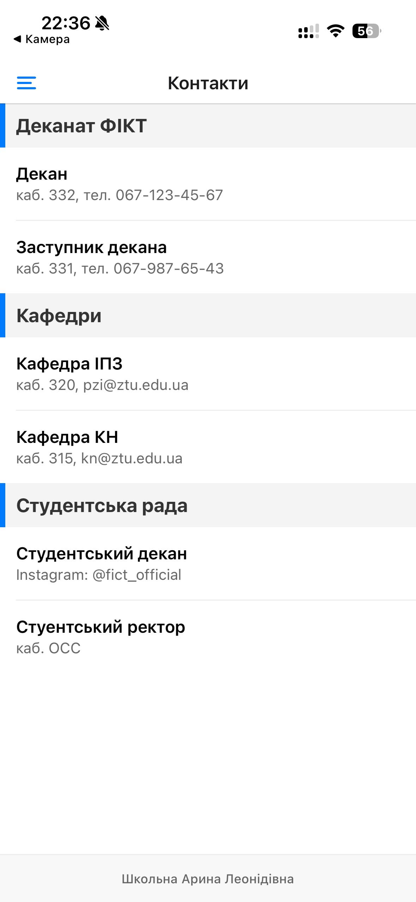

# Лабораторна робота №2: Списки та Навігація в React Native

**Виконала:** Школьна Арина Леонідівна  
**Група:** ІПЗ-22-4


## 1. Опис реалізованого функціоналу
У цій роботі було розроблено мобільний додаток із використанням розширених можливостей навігації та списків:
* **Навігація**: Реалізовано вкладену структуру (Drawer Navigator -> Stack Navigator).
* **Списки новин (FlatList)**: Додано функціонал Pull-to-Refresh, нескінченний скрол (Infinite Scroll) та оптимізацію рендерингу.
* **Екран деталей**: Реалізовано передачу параметрів об'єкта та динамічну зміну заголовка екрана.
* **Екран контактів (SectionList)**: Групування контактів факультету за секціями з використанням липких заголовків.
* **Кастомізація**: Створено власне бічне меню (DrawerContent) з аватаром та інформацією про студента.

## 2. Інструкція із запуску

1. **Встановлення залежностей**:
   ```bash
   npm install
   ```
2. **Запуск проєкту**
   ```bash
   npm expo start
   ```
3. **Тестування**
   Скануйте QR-код через додаток Expo Go на вашому смартфоні.

## 3. Скріншоти роботи застосунку

### Головна сторінка (FlatList)


### Детальна сторінка новин


### Бокова сторінка навігатор


### Сторінка контактів (SectionList)


## Висновки (Контрольні запитання)
Під час виконання роботи було досліджено:
- FlatList vs ScrollView: FlatList є більш ефективним для великих даних завдяки віртуалізації, тоді як ScrollView краще підходить для статичних сторінок.

- Віртуалізація: Це механізм, що дозволяє мобільному додатку працювати плавно, рендерингуючи лише видиму частину списку.

- Навігація: Використання вкладеної навігації дозволяє розділити логіку стрічки новин (Stack) та загальні розділи додатка (Drawer).

- SectionList: Цей компонент є незамінним для створення структурованих довідників, оскільки автоматично керує заголовками груп даних.