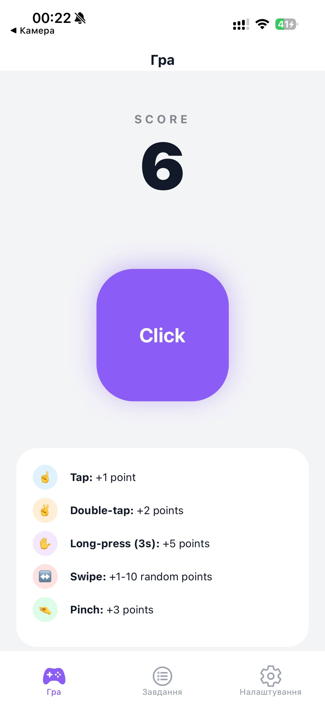
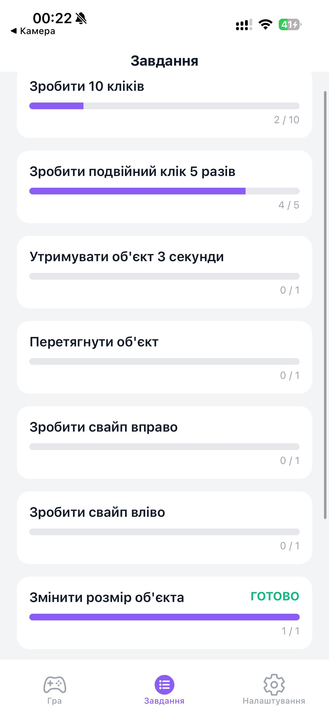
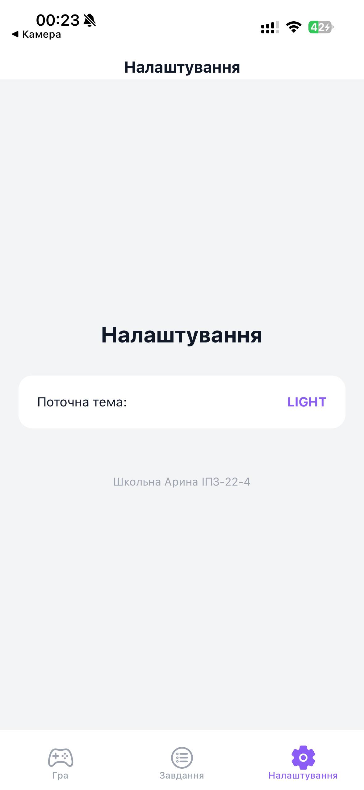
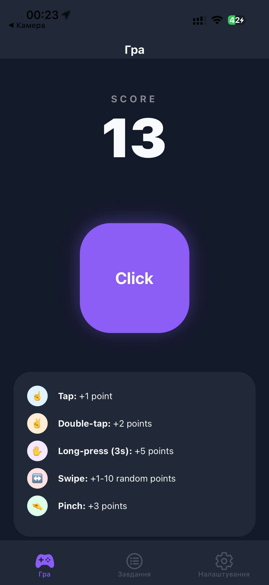
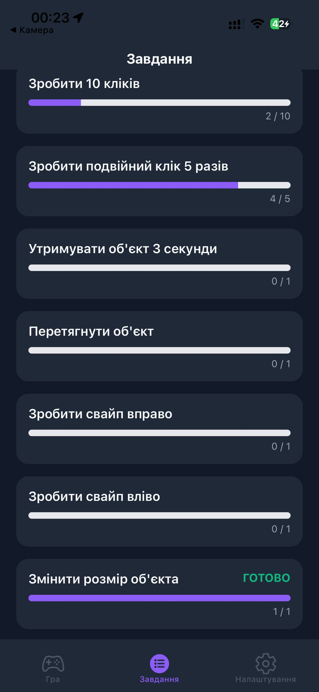
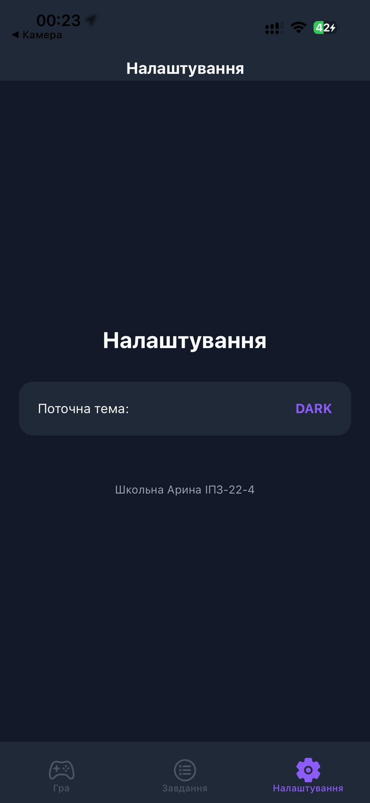

# Лабораторна робота №3: Використання кастомних жестів у React Native та стилізація інтерфейсу мобільного застосунку.

**Виконала:** Школьна Арина Леонідівна  
**Група:** ІПЗ-22-4

## 1. Інструкція із запуску

1. **Встановлення залежностей**:
   ```bash
   npm install
   ```
2. **Запуск проєкту**
   ```bash
   npm expo start
   ```
3. **Тестування**
   Скануйте QR-код через додаток Expo Go на вашому смартфоні.


## 2. Опис реалізованого функціоналу
Додаток являє собою інтерактивний клікер, побудований на базі React Native Gesture Handler. Реалізовано 9 основних завдань та систему прогресу.
#### Основні можливості:
### Система жестів:
* **Tap**: Одинарне натискання (+1 бал).
* **Double Tap**: Подвійне швидке натискання (+2 бали).
* **Long Press**: Утримання об'єкта протягом 3 секунд (+5 балів).
* **Pan**: Вертикальне перетягування об'єкта по екрану (+2 бали).
* **Fling (Left/Right)**: Швидкий свайп вліво або вправо (випадкова кількість балів від 1 до 10).
* **Pinch**: Зміна розміру об'єкта за допомогою двох пальців (+3 бали).
### Система завдань: 
Окремий екран із прогрес-барами, що відстежують виконання кожного типу жесту та загальну кількість очок.

### Динамічна зміна тем: 
Підтримка світлої та темної тем, що змінюють кольорову гаму всього інтерфейсу (включаючи Header та Tab Bar).

### Інформаційна панель: 
Легенда на головному екрані, що пояснює вартість кожної дії.

## 3. Скріншоти роботи застосунку

### Головна сторінка (Клікер)


### Сторінка завдань


### Сторінка налаштувань


### Темні теми




## Висновки 
Під час виконання лабораторної роботи було опановано роботу з бібліотекою react-native-gesture-handler та стандартним API анімацій Animated.
Ключові моменти:

- Вирішення конфліктів жестів: Було налаштовано пріоритетність спрацювання через використання waitFor (для одинарних та подвійних тапів) та simultaneousHandlers (для одночасної роботи пінча та перетягування).

- Оптимізація під Windows: Через обмеження системних ресурсів та проблеми з бандлером Babel, було прийнято рішення використовувати стабільну реалізацію без Reanimated, що забезпечило безперебійну роботу на реальному пристрої.

- Керування станом: Використання React Context API дозволило синхронізувати прогрес завдань та зміну теми між трьома незалежними екранами навігації.