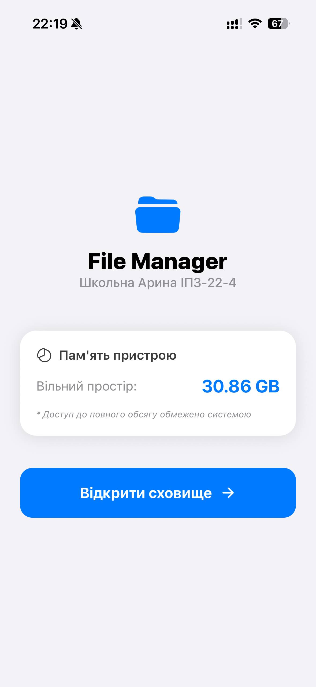
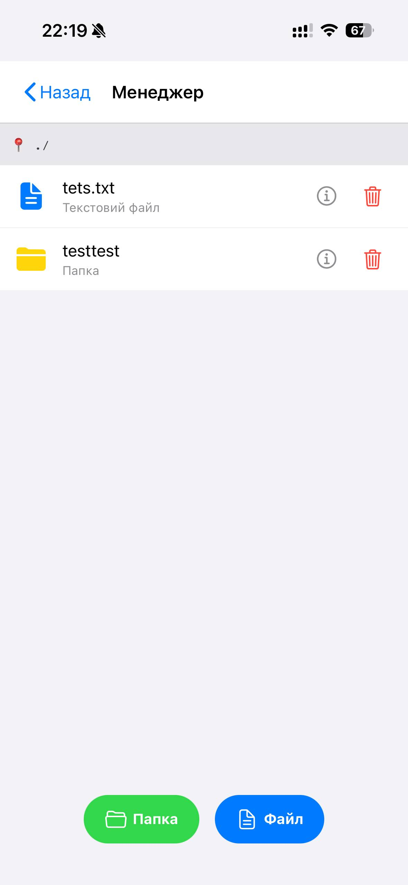
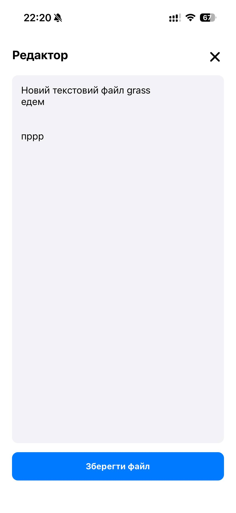
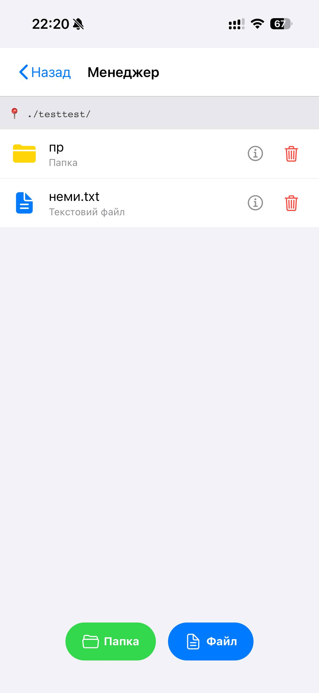

# Лабораторна робота №4: Файловий менеджер.

**Виконала:** Школьна Арина Леонідівна  
**Група:** ІПЗ-22-4

## 1. Інструкція із запуску

1. **Встановлення залежностей**:
   ```bash
   npm install
   ```
2. **Запуск проєкту**
   ```bash
   npm expo start
   ```
3. **Тестування**
   Скануйте QR-код через додаток Expo Go на вашому смартфоні.


## 2. Опис реалізованого функціоналу
Застосунок побудований на базі React Native з використанням Expo SDK. Основна логіка роботи з файлами базується на бібліотеці expo-file-system.
#### Основні можливості:
* **Статистика пам'яті**: Відображення вільного місця на пристрої (реалізовано через API системи).
* **Файлова навігація**: Повноцінний перехід між папками (механізм "вгору/вниз") та відображення поточного шляху.
* **Керування файлами**:
- Створення нових папок.
- Створення текстових файлів (.txt) з початковим контентом.
- Видалення об'єктів (з підтвердженням дії).
* **Робота з текстом**: Вбудований редактор для перегляду та модифікації вмісту .txt файлів.
* **Інформація про об'єкти**: Перегляд детальних атрибутів (назва, тип, розмір у байтах, дата останньої зміни).

## 3. Скріншоти роботи застосунку

### Головна сторінка (Пам'ять пристрою)


### Головна папка менеджера


### Редактор файлу


### Вміст папки в папці

