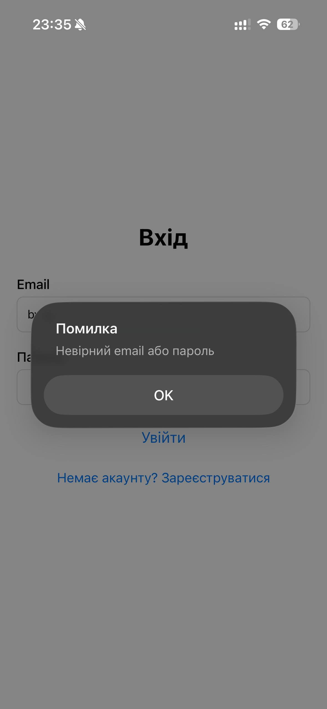
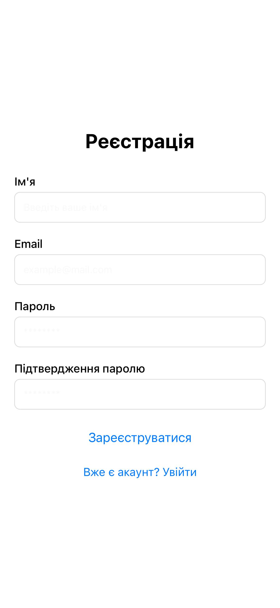
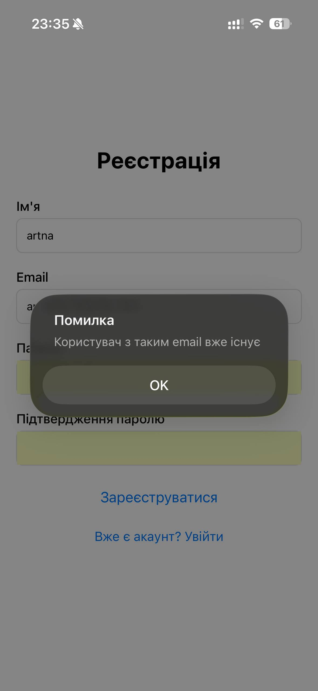
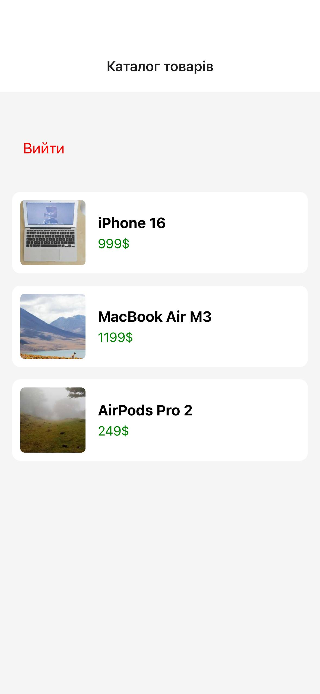

# Лабораторна робота №5: Побудова навігації у React Native із використанням бібліотеки Expo Router.

**Виконала:** Школьна Арина Леонідівна  
**Група:** ІПЗ-22-4

## 1. Інструкція із запуску

1. **Встановлення залежностей**:
   ```bash
   npm install
   ```
2. **Запуск проєкту**
   ```bash
   npm expo start
   ```
3. **Тестування**
   Скануйте QR-код через додаток Expo Go на вашому смартфоні.


## 2. Опис реалізованого функціоналу
У ході лабораторної роботи було реалізовано мобільний застосунок для каталогу товарів з використанням **Expo Router**:
- **File-based маршрутизація**: структура папок у `/app` визначає шляхи в додатку.
- **Глобальний контекст авторизації**: реалізовано через `React Context` для збереження стану користувача.
- **Захищені маршрути**: група `(app)` доступна лише після входу, реалізовано автоматичний редирект неавторизованих користувачів.
- **Публічні екрани**: форми реєстрації та входу з валідацією.
- **Динамічна навігація**: перехід до деталей конкретного товару за його ID.
- **Обробка помилок**: кастомний екран для неіснуючих маршрутів (+not-found).

## 3. Скріншоти роботи застосунку

### Сторінка Входу



### Сторінка Реєстрація



### Каталог товарів


### Детальна інформація про товар


## 4. Висновки (Контрольні питання)

**1. Яким чином за допомогою Expo Router реалізується перенаправлення неавторизованого користувача?** 
- Це реалізується через файл `_layout.jsx` у захищеній групі. Ми перевіряємо стан `isAuthenticated` з контексту: якщо він `false`, використовуємо компонент `<Redirect href="/login" />`.

**2. У чому полягає різниця між використанням компонента <Link> та метода router.push()?**
- `<Link>` — це декларативний підхід, схожий на `<a>` в HTML, краще підходить для статичних переходів. `router.push()` (або `router.replace()`) — це програмний підхід, який дозволяє виконувати перехід всередині функцій (наприклад, після успішної перевірки логіну).

**3. Як працюють динамічні маршрути в Expo Router і як отримати передані параметри?** 
- Динамічні маршрути створюються за допомогою квадратних дужок у назві файлу, наприклад `[id].jsx`. Отримати параметри можна за допомогою хука `useLocalSearchParams()`.

**4. Чому стан авторизації доцільно зберігати у глобальному контексті (React Context), а не в локальному стані компонента?** 
- Тому що інформація про те, чи увійшов користувач, потрібна багатьом екранам та макетам (layouts) одночасно для прийняття рішення про рендеринг або редирект. Контекст дозволяє уникнути "prop drilling".

**5. Для чого використовуються групи маршрутів (folderName) і як вони впливають на URL-адресу?** 
- Групи маршрутів у дужках дозволяють логічно організувати файли та застосовувати спільні Layouts до певних частин додатку, не впливаючи на шлях у URL (сама назва папки в дужках ігнорується).