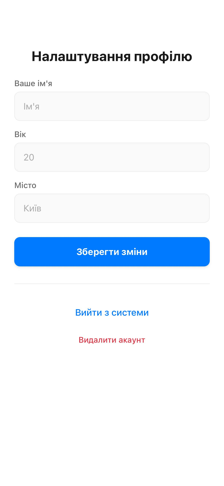
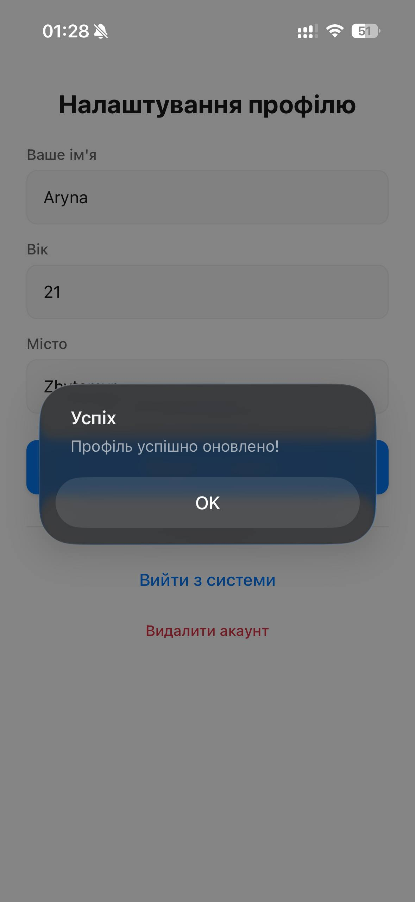
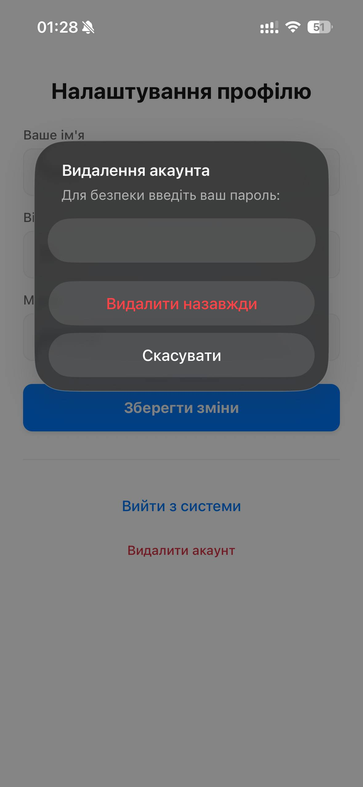

# Лабораторна робота №6: Побудова авторизації та збереження персональних даних у React Native з використанням Firebase Authentication та Firestore

**Виконала:** Школьна Арина Леонідівна  
**Група:** ІПЗ-22-4

## 1. Інструкція із запуску

1. **Встановлення залежностей**:
   ```bash
   npm install
   ```
2. **Запуск firebase**:
   - Запустити Firebase та створити проект lab6
   - Скопіювати **firebaseConfig** та вставити у файл [firebase](/firebaseConfig.js)
   - Налаштувати Firebase Authentication обрати для Sign-in method варіант email/password
   - Перейти до налаштування Firestore Database, створити database та запустити
   - Перейти на вкладку **Rules** та налаштувати Firestore Security Rules: замінити існуючий код на цей:
   ```
   service cloud.firestore {
      match /databases/{database}/documents {
         match /users/{userId} {
            allow read, write: if request.auth != null && request.auth.uid == userId;
         }
      }
   }
   ```
3. **Запуск проєкту**
   ```bash
   npm expo start
   ```
4. **Тестування**
   Скануйте QR-код через додаток Expo Go на вашому смартфоні.


## 2. Опис реалізованого функціоналу
У межах лабораторної роботи було розроблено мобільний застосунок на базі **Expo** та **Expo Router**, з використанням **Firebase Authentication та Firestore** який реалізує:
- **Систему автентифікації:** реєстрація нових користувачів, вхід в існуючий акаунт та безпечний вихід.
- **Відновлення доступу:** функція скидання пароля через електронну пошту.
- **Керування профілем:** можливість додавати та редагувати персональні дані (ім’я, вік, місто).
- **Базу даних Firestore:** синхронізація даних користувача в реальному часі.
- **Безпеку:** налаштовані `Firestore Security Rules`, що дозволяють користувачам працювати виключно зі своїми даними.
- **Видалення акаунта:** реалізовано механізм повторної автентифікації перед повним видаленням даних.

## 3. Скріншоти роботи застосунку

### Сторінка Входу


### Сторінка Входу(Незаповнені поля)


### Скидання паролю


### Сторінка Реєстрація


### Інормація про користувача



### База даних


### Видалення акаунту



## 4. Висновки 
Під час виконання роботи було набуто практичних навичок роботи з екосистемою Firebase у поєднанні з React Native. Реалізовано централізоване керування станом авторизації через AuthContext та захищену навігацію за допомогою Expo Router. Налаштовані правила безпеки Firestore підтвердили важливість валідації запитів на стороні сервера для захисту персональних даних.
